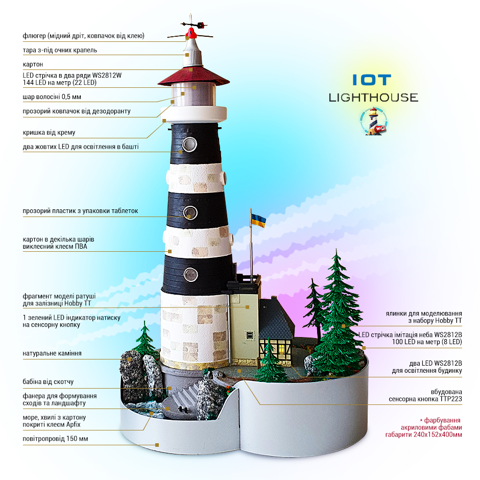
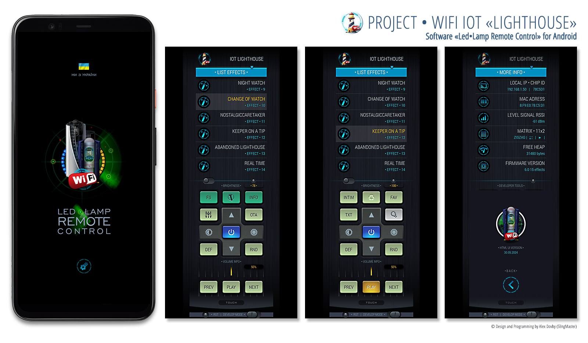

# LighthouseIOT
Arduino project IOT Lighthouse

(UA)

## IOT Lighthouse
### Firmware «Lighthouse»
### Версія 6.XX

Прошивка для IOT Lighthouse та кросплатформне програмне забезпечення для керування. Проект поєднує в собі діораму «Маяк» з використанням візуального та звукового супроводу з можливістю дистанційного керування по WiFi. Прошивка сумісна з програмним забезпеченням для лампи «Javelin». Оновлення по OTA.

IOT Lighthouse може керуватися від сенсорної кнопки, вбудованої в конструкцію, дистанційно програмним забезпеченням та від датчиків, вбудованих у робота «WiFi Robot007». Озвучення підібране таким чином, щоб підкреслити назву ефекту та підтримати візуальні ефекти. В основному це плескіт моря для створення релаксу та ефекти жартів. Кожну годину в денний час б'ють склянки. Можна використовувати як MP3 плеєр. Для цього потрібно створити папку `MP3` на SD для DFPlayer. Для коректної роботи потрібно, щоб хоча б один файл мав у своїй назві `0001_`. Це потрібно для коректного старту. Решта файлів можна не перейменовувати (документація до DFPlayer рекомендує такий формат `0001.mp3 ... 3000.mp3`).

## Візуальні ефекти:

- імітація прожектора маяка,
- час доби,
- природні явища (гроза, туман, веселка),
- освітлення сходів у башті маяка,
- освітлення в будинку наглядача маяка.

## Soft

Кросплатформне програмне забезпечення для керування

### Функції:

- дистанційне управління вибором ефектів;
- налаштування користувача;
- управління MP3 плеєром (play, stop, prev, next, volume level);

- **з браузера та для iOS за посиланням:**
  - UI (UA) • [http://winecard.ltd.ua/dev/WifiLampRemote3/index.html?ip=192.168.1.1&dev=1&timeout=200&sound=1&lang=0](http://winecard.ltd.ua/dev/WifiLampRemote3/index.html?ip=192.168.1.1&dev=1&timeout=200&sound=1&lang=0)
  - **Примітка:** Потрібно вказати IP роутера.

- **для Windows:**
  - Папка `\RemoteControlForWindows`, інсталяція не потрібна.

- **для Android:**
  - Файл установки `.apk` у папці `\RemoteControlForAndroid`.

Для входу в релакс я попросив ChatGPT створити коротке оповідання.

<i>На узбережжі моря стояв старий, але надійний маяк. Його вогні вже багато років вказували шлях кораблям, допомагаючи морякам уникати небезпек. Доглядачем цього маяка був Олександр Семенович – добрий і розумний чоловік з великим почуттям гумору. У вільний від вахти час він захоплювався програмуванням і дизайном, створюючи неймовірні проєкти на своєму ноутбуці. Крім того, Олександр Семенович був великим поціновувачем вина: взимку та восени він полюбляв червоне, весною та влітку – біле, а особливо цінував оранжеве вино, особливо грузинське.

Разом з ним жив його ліпший друг – маленький чіхуахуа на ім'я Арчибальд, або просто Арчік. Арчік був незвичайним собакою: він мав відмінну логіку і навіть претендував на вакансію Junior у сфері ІТ. Кожного вечора, коли Олександр Семенович розпочинав свою програмістську роботу, Арчік сідав у нього на руках, уважно спостерігаючи за процесом.

Одного весняного вечора, після завершення чергової вахти, Олександр Семенович вирішив трохи розслабитися. Він відкоркував пляшку свого улюбленого білого вина і налив собі келих. Не забув він і про свого вірного друга – дістав із шафи улюблений собачий смаколик Арчіка. Побачивши це, Арчік одразу побіг до кухні, де на підлозі стояла його миска з водою, і зобразив щось схоже на горде чіхуахуаське «на здоров'я», випивши води так, ніби це був келих вина, потім повернувся і стрибнув на руки свого господаря та почав смакувати смаколик.

Олександр Семенович весело посміхнувся і, взявши в руки ноутбук, почав працювати над новим проєктом – програмою для управління маяком на основі штучного інтелекту. Він вирішив назвати її «Ностальгуючий Доглядач», в честь своїх численних спогадів про бурхливу молодість. Хоча він не був моряком, але за своє життя встиг побувати і токарем, і програмістом, і багато ким іншим. Арчік тим часом вмостився зручніше на його руках і уважно спостерігав за кодом, іноді навіть гавкаючи, коли помічав можливі помилки.

Втомлений після кількох годин роботи, Олександр Семенович вирішив зробити перерву. Він підняв келих і сказав:
– Ну що, Арчіку, як тобі наш новий проєкт? Вийде з нас крутий дует програмістів!

Арчік, задоволено виляючи хвостиком, гавкнув у відповідь, наче підтверджуючи слова свого господаря. Олександр Семенович підняв келих ще раз і, посміхаючись, промовив:
– За наші проєкти, за наш маяк і за наше вино! І, звісно, за наші спогади. Сподіваюсь, одного дня ти, Арчіку, таки станеш справжнім Junior програмістом.

З цими словами вони продовжили роботу, створюючи нові рядки коду, які, можливо, одного дня стануть основою для революційного програмного забезпечення. А поки що, у маяка на узбережжі моря, де завжди вирує вітер і пахне солоним повітрям, їхня команда – мудрий доглядач і його вірний собака – продовжувала творити майбутнє, не забуваючи про гумор і радість життя.</i>

---

Прошивка є глибокою адаптацією прошивок для лампи «Javelin» та «Robot 007», тому стартує з версії 6.XX. Основні файли коду та бібліотеки сумісні між прошивками; видалено лише те, що не потрібно.

Посилання на робота:
- [Video](https://www.youtube.com/watch?v=ttAgw9oOo6I&t=141s)
- [Firmware WiFiRobot007](https://github.com/SlingMaster/WiFiRobot007)

Посилання на цю прошивку та програмне забезпечення:
- [Firmware Lighthouse](https://github.com/SlingMaster/LighthouseIOT)

* Для повтору можна скористатися інструкцією у файлі `Instruction.doc`.
* Потрібні бібліотеки знаходяться в архіві `libraries`.
* Файли озвучення знаходяться в архіві `SD`. Треба зробити копію та вставити в `DFPlayer`.

Зверніть увагу, що в папках `50` та `75` можуть бути MP3 композиції на ваш розсуд:

* `50` – ностальгуюча музика для ефекту "Ностальгуючий доглядач"
* `75` – щось під ефект "Доглядач на підпитку" на ваш розсуд

Єдина умова: максимум 255 файлів у папках, і назви файлів повинні починатися з номеру треку у форматі від `001` до `255` без пропусків.

Схема знаходиться в директорії `\Schemes`.

### Модулі, використані в конструкції:

* Wemos ESP8266
* DFPlayer
* TTP223 – сенсорна кнопка
* LED стрічка на базі адресних світлодіодів WS2812

### Дії сенсорної кнопки для цієї прошивки:

* одноразовий клік – увімкнення або вимкнення
* дворазовий клік – наступний ефект
* триразовий клік – попередній ефект
* чотириразовий клік – запуск відтворення ефектів у циклі
* п'ятиразовий клік – послати російський корабель за відомим курсом
* шестиразовий клік – запуск таймера вимкнення лампи через 5 хвилин
* семиразовий клік – зміна робочого режиму лампи: з WiFi точки доступу на WiFi клієнт чи навпаки

### Прошивка має 15 тематичних візуально-звукових ефектів:

* "Штиль на морі"
* "Дощ на морі"
* "Шторм на морі"
* "Шторм із грозою"
* "Туман в Одесі"
* "Ранній ранок"
* "Сієста"
* "Тихий вечір"
* "Вечірня вахта"
* "Нічна вахта"
* "Зміна з вахти"
* "Ностальгуючий доглядач"
* "Доглядач на підпитку"
* "Занедбаний маяк"
* "RealTime"

Ефект "RealTime" використовує дані з openweathermap.org для відображення візуальних та звукових ефектів на базі даних погоди та значень сходу й заходу сонця в реальному часі.

Додаткові відео про інші проекти Arduino можна знайти на YouTube-каналі SlingMasterJSC за посиланням: [YouTube-Channel SlingMasterJSC](https://www.youtube.com/@SlingMasterJSC)

---

(EN)

## IOT Lighthouse
### Firmware "Lighthouse"
### Version 6.XX

Firmware for the IOT Lighthouse and cross-platform software for control. The project combines a "Lighthouse" diorama with visual and sound accompaniment and the ability to control it remotely via WiFi. The firmware is compatible with the software for the "Javelin" lamp. Update via OTA.

IOT Lighthouse can be controlled by the touch button built into the structure, remotely by software, and by sensors embedded in the "WiFi Robot007". The sound effects are selected to highlight the name of the effect and support the visual effects, mainly the sound of the sea for relaxation and humorous effects. Every hour during the day, the glass strikes. You can use this as an MP3 player. To do this, create an `MP3` folder on the SD card for the DFPlayer. For correct operation, at least one file must have `0001_` in its name. This is required for proper startup. Other files do not need to be renamed (DFPlayer documentation recommends the format `0001.mp3 ... 3000.mp3`).

## Visual Effects:

- lighthouse spotlight simulation
- time of day
- natural phenomena (thunderstorm, fog, rainbow)
- lighting of the stairs in the lighthouse tower
- lighting in the lighthouse keeper's house

## Soft

Cross-platform software for management

### Functions:

- remote control of effect selection;
- user settings;
- MP3 player control (play, stop, prev, next, volume level);

- **from a browser and for iOS at the link:**
  - UI (EN) • [http://winecard.ltd.ua/dev/WifiLampRemote3/index.html?ip=192.168.1.1&dev=1&timeout=200&sound=1&lang=1](http://winecard.ltd.ua/dev/WifiLampRemote3/index.html?ip=192.168.1.1&dev=1&timeout=200&sound=1&lang=1)

  - **Note:** You need to specify the router's IP.

- **for Windows:**
  - Folder `\RemoteControlForWindows`, no installation needed.

- **for Android:**
  - Installation file `.apk` in the folder `\RemoteControlForAndroid`.

To get into relaxation mode, I asked ChatGPT to create a short story.

<i>On the seashore stood an old but reliable lighthouse. Its lights had guided ships for many years, helping sailors avoid dangers. The keeper of this lighthouse was Oleksandr Semenovych, a kind and wise man with a great sense of humor. In his free time, he was passionate about programming and design, creating incredible projects on his laptop. Additionally, Oleksandr Semenovych was a great wine enthusiast: he preferred red wine in winter and autumn, white wine in spring and summer, and especially valued orange wine, particularly Georgian.

His best friend, a little Chihuahua named Archibald, or simply Archik, lived with him. Archik was an unusual dog: he had excellent logic and even aspired to a Junior IT position. Every evening, when Oleksandr Semenovych started his programming work, Archik would sit on his lap, attentively watching the process.

One spring evening, after finishing another shift, Oleksandr Semenovych decided to relax a bit. He opened a bottle of his favorite white wine and poured himself a glass. He didn't forget about his faithful friend either – he took Archik's favorite dog treat from the cupboard. Seeing this, Archik immediately ran to the kitchen, where his water bowl stood on the floor, and mimicked a proud Chihuahua "cheers," drinking the water as if it were a glass of wine. Then he returned and jumped onto his master's lap, enjoying the treat.

Oleksandr Semenovych smiled cheerfully and, taking his laptop, began working on a new project – a program for controlling the lighthouse based on artificial intelligence. He decided to name it "Nostalgic Keeper," in honor of his many memories of a lively youth. Although he was not a sailor, he had been a turner, a programmer, and many other things in his life. Meanwhile, Archik settled comfortably on his lap, attentively watching the code, occasionally barking when he noticed possible errors.

Tired after a few hours of work, Oleksandr Semenovych decided to take a break. He raised his glass and said:
- Well, Archik, how do you like our new project? We'll make a great duo of programmers!

Archik, wagging his tail contentedly, barked in response, as if confirming his master's words. Oleksandr Semenovych raised his glass again and, smiling, said:
- To our projects, to our lighthouse, and to our wine! And, of course, to our memories. I hope that one day, Archik, you'll indeed become a real Junior programmer.

With these words, they continued their work, creating new lines of code that might one day become the basis for revolutionary software. Meanwhile, at the lighthouse on the seashore, where the wind always blows and the air smells salty, their team – the wise keeper and his loyal dog – continued to create the future, never forgetting humor and the joy of life.</i>

---

The firmware is a deep adaptation of the firmware for the "Javelin" lamp and "Robot 007," hence it starts at version 6.XX. The main code files and libraries are compatible between the firmwares, with only unnecessary parts removed.

Links to the robot:
- [Video](https://www.youtube.com/watch?v=ttAgw9oOo6I&t=141s)
- [Firmware WiFiRobot007](https://github.com/SlingMaster/WiFiRobot007)

Links to this firmware and software:
- [Firmware Lighthouse](https://github.com/SlingMaster/LighthouseIOT)

* To replicate, you can use the instructions in the `Instruction.doc` file.
* Required libraries are in the `libraries` archive.
* Sound files are in the `SD` archive. Make a copy and insert it into `DFPlayer`.

Note that the `50` and `75` folders may contain MP3 tracks at your discretion:

* `50` – nostalgic music for the "Nostalgic Keeper" effect
* `75` – something for the "Keeper Tipsy" effect at your discretion

The only condition: a maximum of 255 files in the folders, and the file names must start with the track number in the format from `001` to `255` without gaps.

The scheme is located in the `\Schemes` directory.

### Modules used in the construction:

* Wemos ESP8266
* DFPlayer
* TTP223 – touch button
* LED strip based on addressable LEDs WS2812

### Touch button actions for this firmware:

* single click – turn on or off
* double click – next effect
* triple click – previous effect
* quadruple click – start effect playback in a loop
* quintuple click – send the Russian ship in the known direction
* sextuple click – start the lamp shutdown timer for 5 minutes
* septuple click – change the lamp's operating mode: from WiFi access point to WiFi client or vice versa

### The firmware has 15 thematic visual and sound effects:

* "Calm Sea"
* "Rain at Sea"
* "Storm at Sea"
* "Storm with Thunder"
* "Fog in Odessa"
* "Early Morning"
* "Siesta"
* "Quiet Evening"
* "Evening Watch"
* "Night Watch"
* "Shift Change"
* "Nostalgic Keeper"
* "Keeper Tipsy"
* "Abandoned Lighthouse"
* "RealTime"

The "RealTime" effect uses data from openweathermap.org to display visual and sound effects based on weather data and sunrise and sunset times in real time.

Additional videos about other Arduino projects can be found on the SlingMasterJSC YouTube channel at this link: [YouTube-Channel SlingMasterJSC](https://www.youtube.com/@SlingMasterJSC)

---

## Change Log

(UA)

### Firmware IOT Lighthouse | 15 ефектіd
### Версія 6.00 

(EN)

### Firmware IOT Lighthouse | 15 effects
### Version 6.00 

---